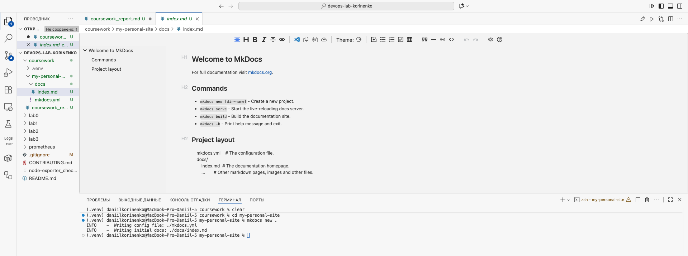
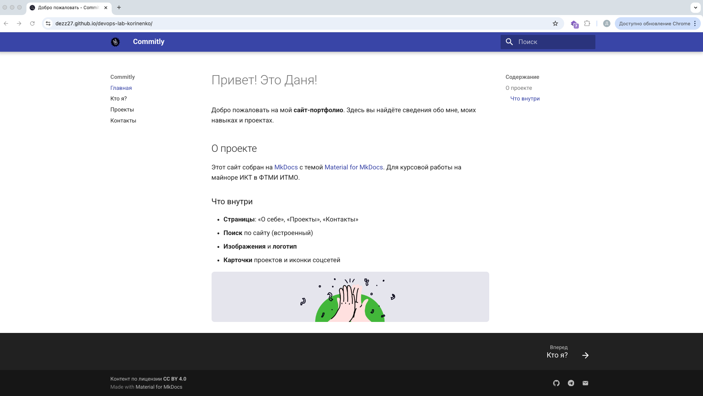
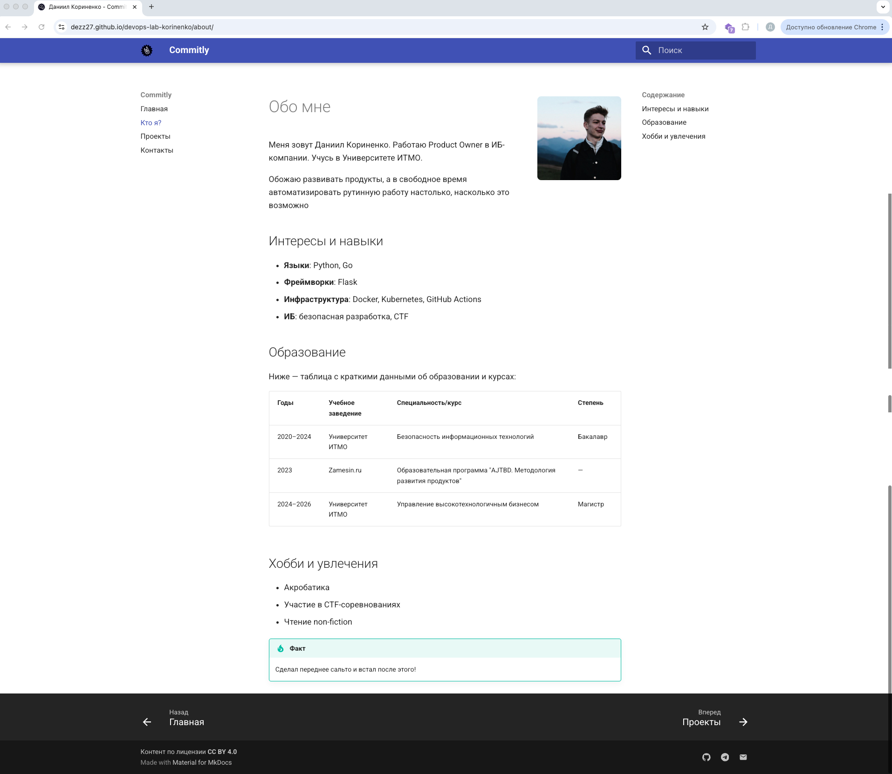
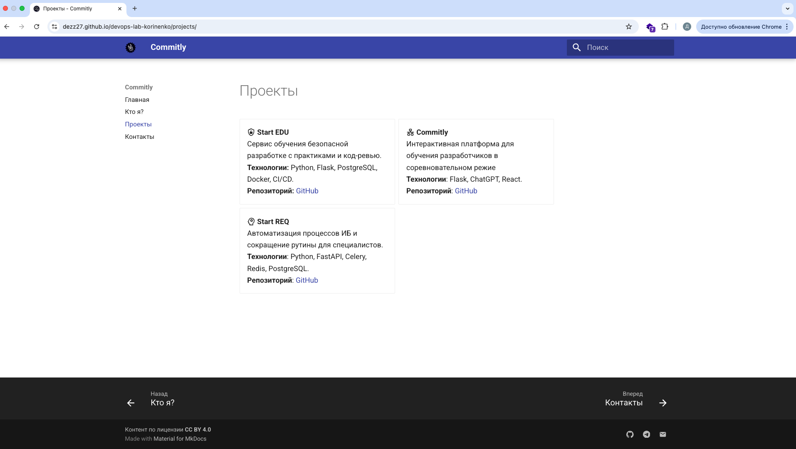
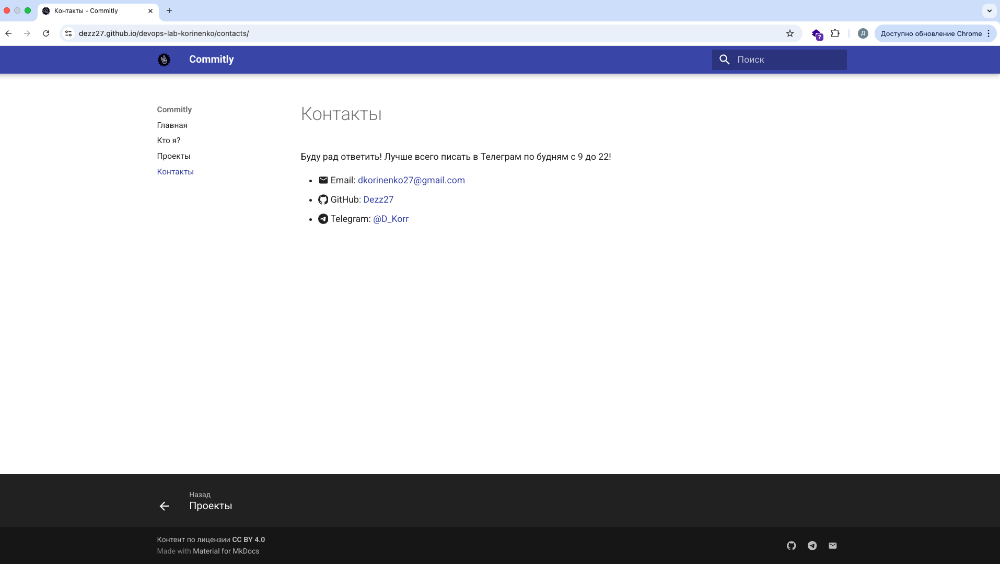
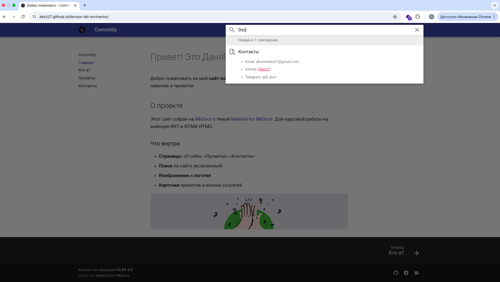

University: [ITMO University](https://itmo.ru/ru/)\

Faculty: [FTMI](https://ftmi.itmo.ru/)\

Course: [Введение в веб технологии](https://itmo-ict-faculty.github.io/introduction-in-web-tech/)\

Year: 2025/2026\

Group: U4225\

Author: Korinenko Daniil Trofimovich\

Lab: Coursework\

Date of create: 16.10.2025\

Date of finished: 16.10.2025\

#### Link to MKDocs site: [https://dezz27.github.io/devops-lab-korinenko/](https://dezz27.github.io/devops-lab-korinenko/)

### Stage 1

1. Создали проект MkDocs 
2. Главная страница (есть структура, favicon, лого, картинки и футер)
3. Страница обо мне. Есть разметка и фотографии 
4. Страница с проектами в виде карточек 
5. Страница "Контакты" с ссылками 
6. Поиск работает 
