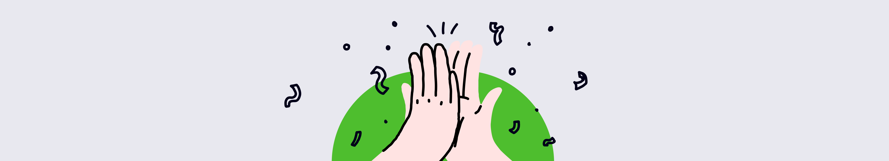

# Привет! Это Даня!

Добро пожаловать на мой **сайт-портфолио**. Здесь вы найдёте сведения обо мне, моих навыках и проектах.

## О проекте

Этот сайт собран на [MkDocs](https://www.mkdocs.org) с темой [Material for MkDocs](https://squidfunk.github.io/mkdocs-material/). Для курсовой работы на майноре ИКТ в ФТМИ ИТМО.

### Что внутри

- **Страницы**: «О себе», «Проекты», «Контакты»
- **Поиск** по сайту (встроенный)
- **Изображения** и **логотип**
- **Карточки** проектов и иконки соцсетей

{ .full-width }
