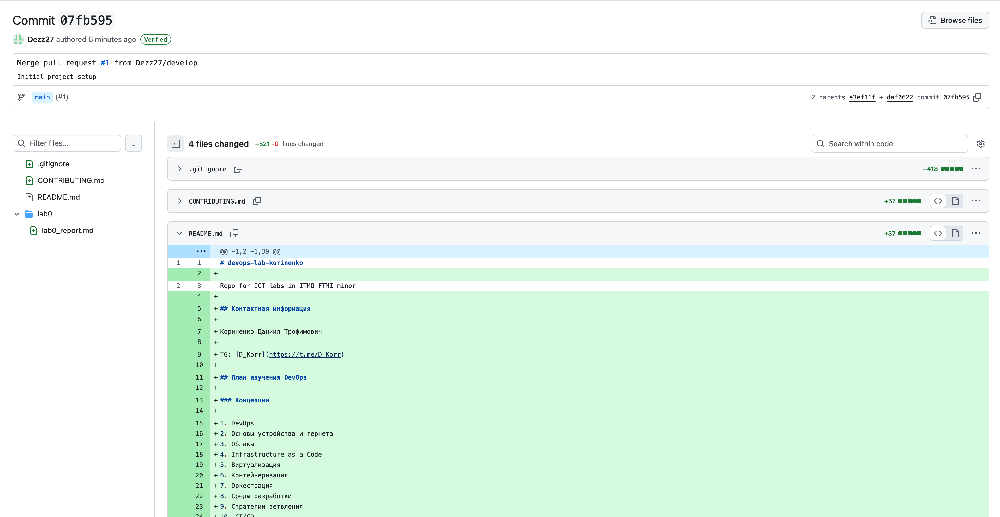

University: [ITMO University](https://itmo.ru/ru/)\
Faculty: [FTMI](https://ftmi.itmo.ru/)\
Course: [Введение в веб технологии](https://itmo-ict-faculty.github.io/introduction-in-web-tech/)\
Year: 2025/2026\
Group: U4225\
Author: Korinenko Daniil Trofimovich\
Lab: Lab0\
Date of create: 03.10.2025\
Date of finished: 03.10.2025\

Screenshots from commit history

1. Added all files 
2. Added `README.md `
3. Added `.gitignore` 
4. Committed to `develop` branch
5. Merged `develop` with `main`
