University: [ITMO University](https://itmo.ru/ru/)\
Faculty: [FTMI](https://ftmi.itmo.ru/)\
Course: [Введение в веб технологии](https://itmo-ict-faculty.github.io/introduction-in-web-tech/)\
Year: 2025/2026\
Group: U4225\
Author: Korinenko Daniil Trofimovich\
Lab: Lab1\
Date of create: 03.10.2025\
Date of finished: 03.10.2025\

### Base task

1. `docker --version` & `docker run hello-world` 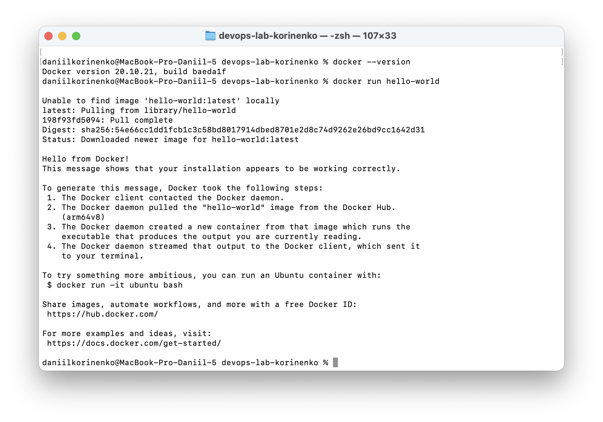
2. `docker images` 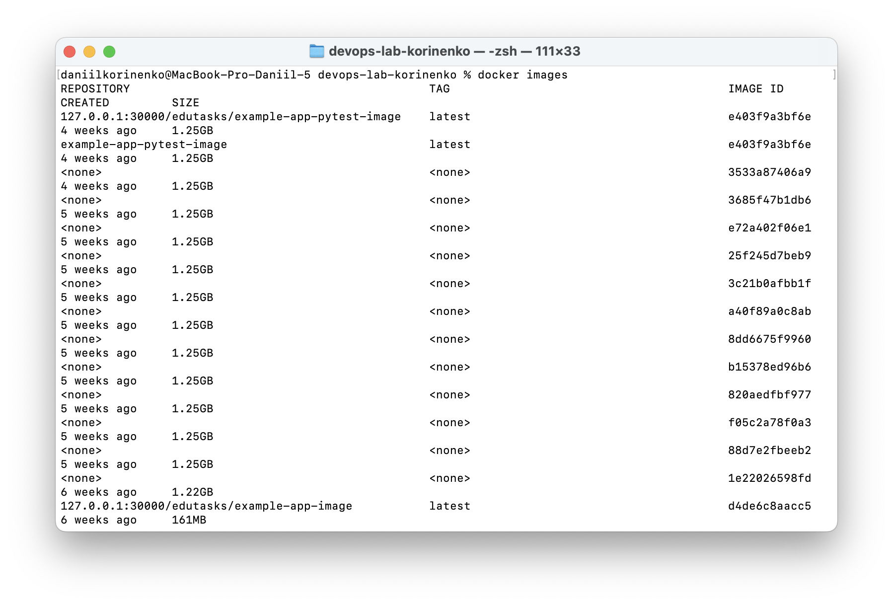
3. `docker ps` & `docker ps -a` 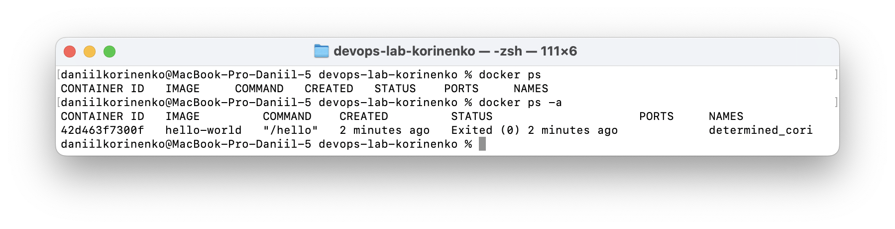
4. Interactive Ubuntu + curl installing 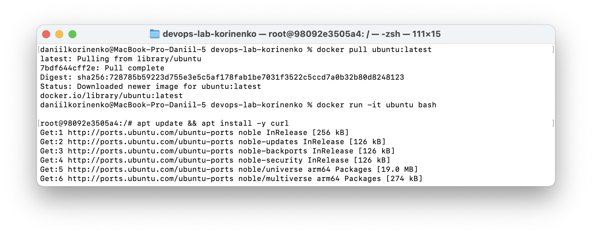 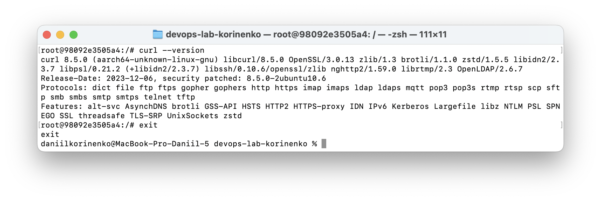
5. Nginx container 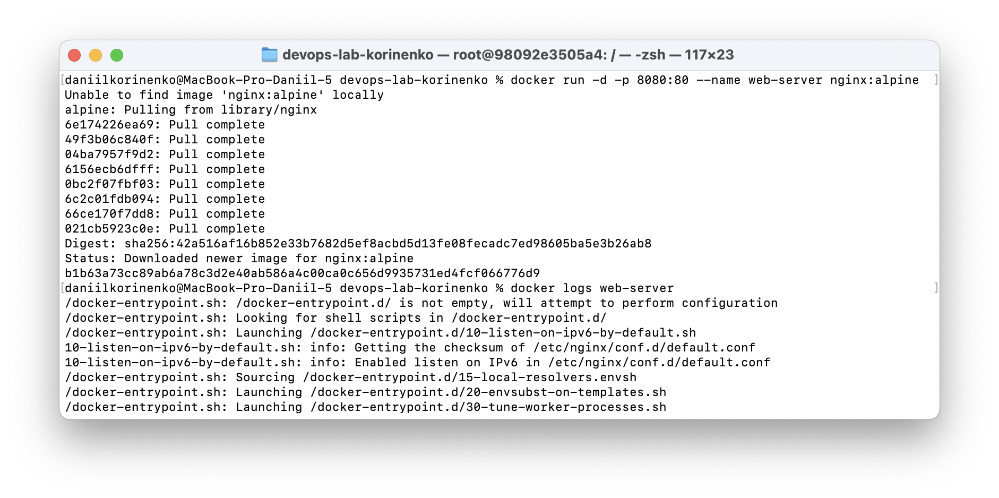 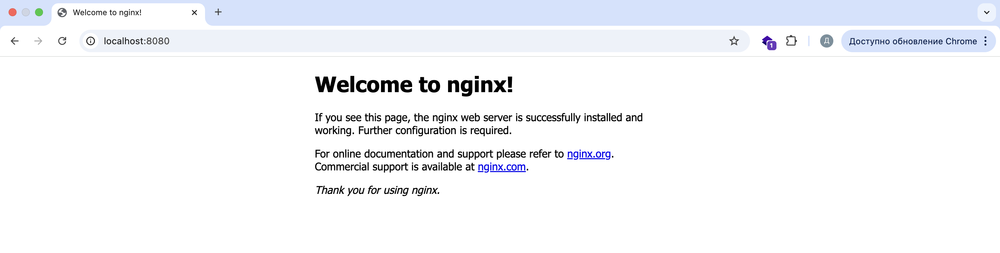 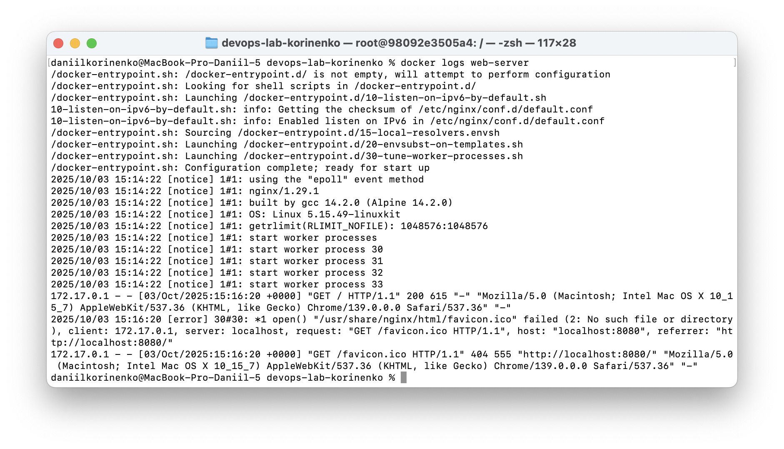 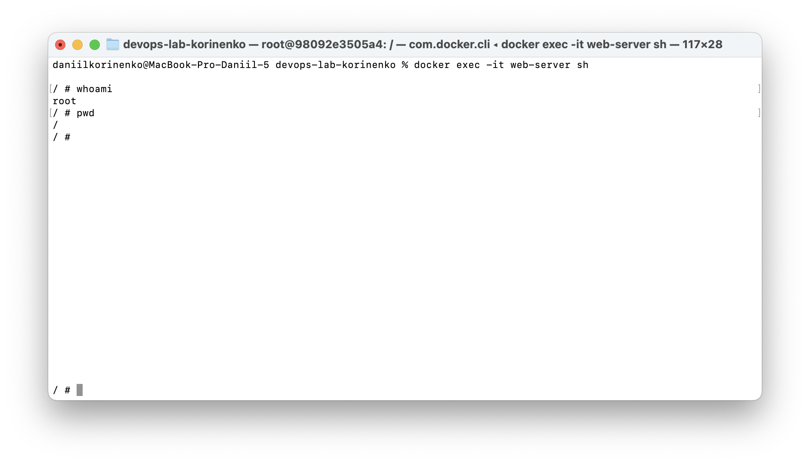
6. Container management 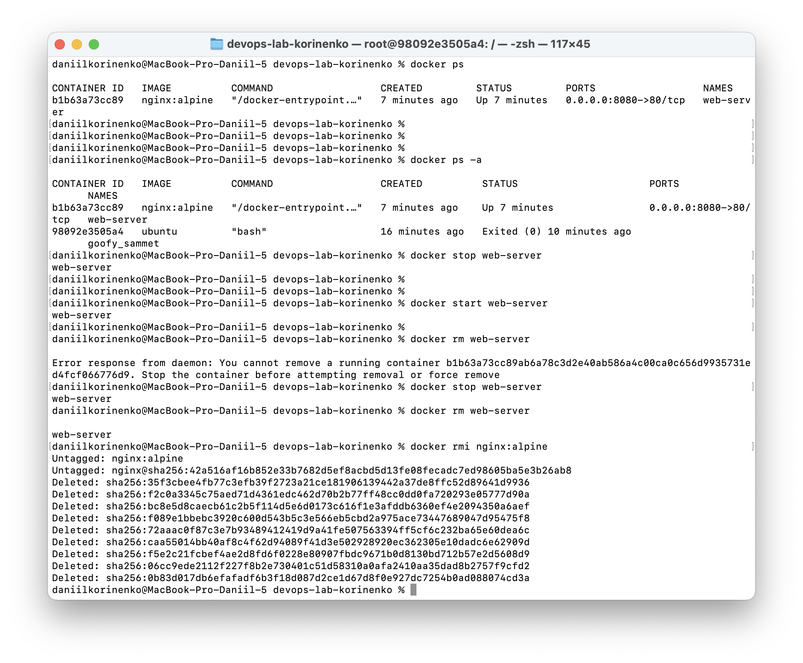
7. Volume test 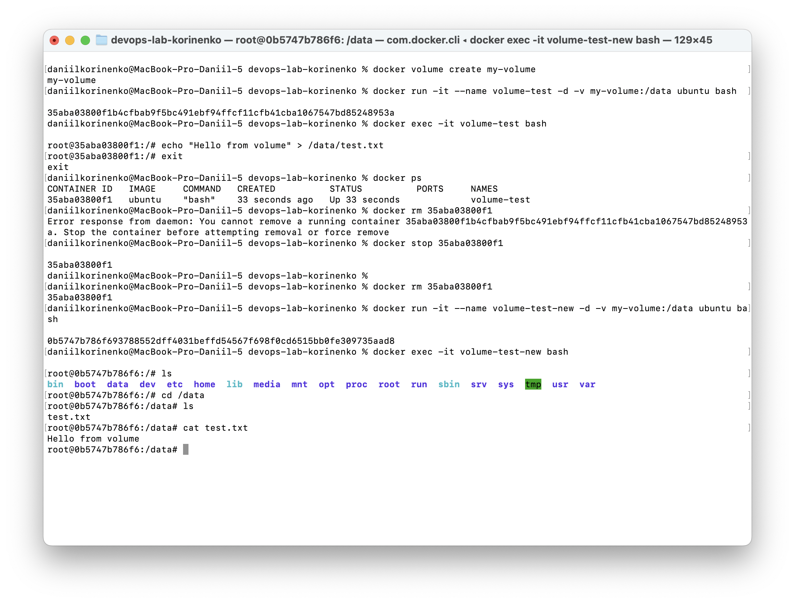

### Extra task

1. Dockerfile 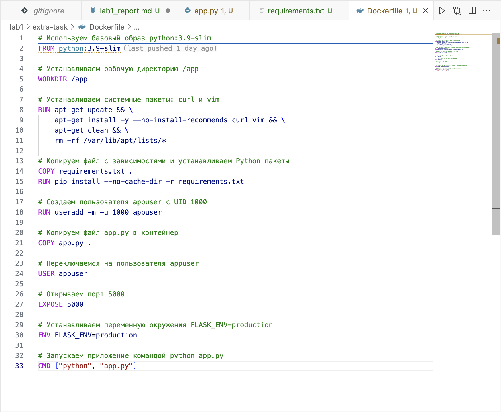
2. Сбор и запуск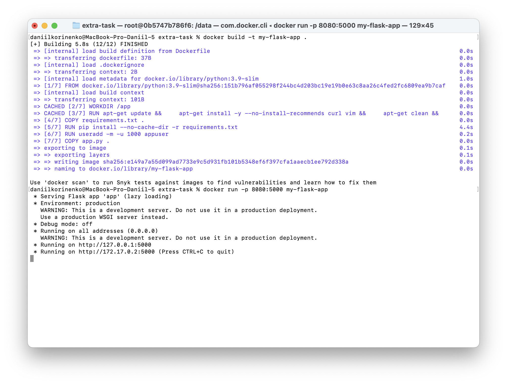 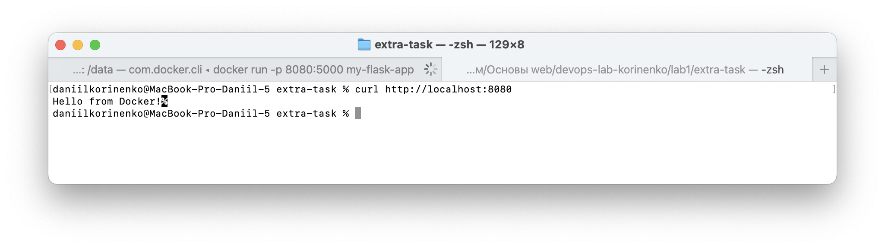
