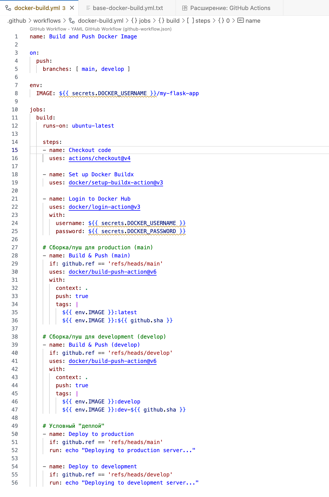
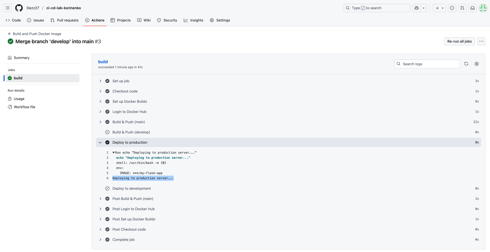

University: [ITMO University](https://itmo.ru/ru/)\

Faculty: [FTMI](https://ftmi.itmo.ru/)\

Course: [Введение в веб технологии](https://itmo-ict-faculty.github.io/introduction-in-web-tech/)\

Year: 2025/2026\

Group: U4225\

Author: Korinenko Daniil Trofimovich\

Lab: Lab2\

Date of create: 06.10.2025\

Date of finished: 06.10.2025\

### Base task

1. Созданы репозитории на GitHub и DockerHub  
2. Создана структура и добавлен файл `docker-build.yml`
3. Push выполнен успешно, демонстрация из GitHub Actions и DockerHub  

### Extra Task

Создали новый `docker-build.yml` 

#### Develop push

1. Создали и запушили в `develop` ветку
2. В DockerHub появился image с develop-тегами 
3. Успех в GitHub Actions и отображение сообщения 

#### Main push

1. В качестве коммита в `main` используем мердж с `develop` 
2. Успешный деплой и соотвествующее сообщение 
3. Новые main-теги в DockerHub 
