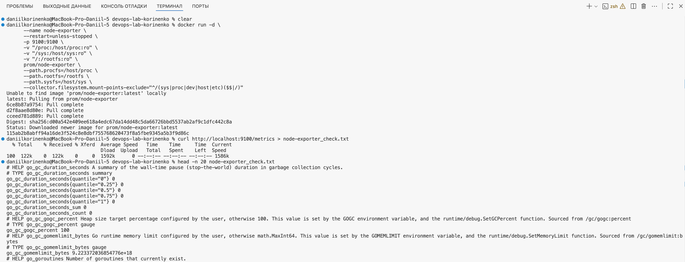
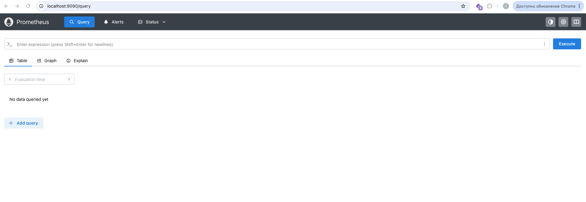
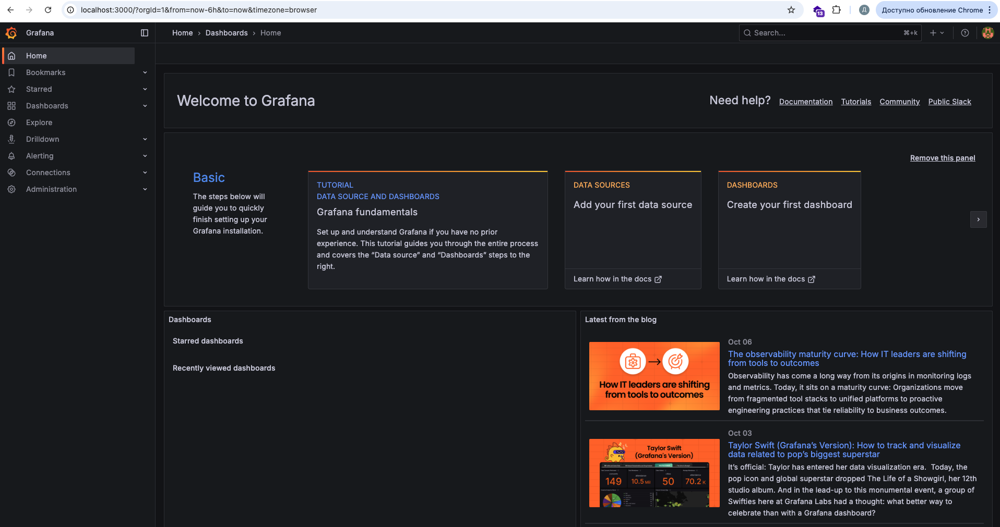
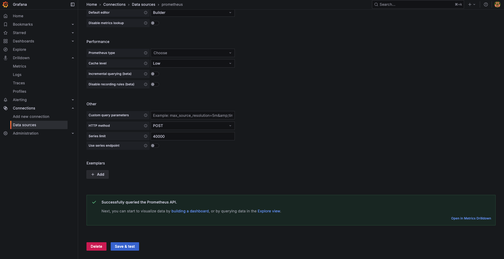
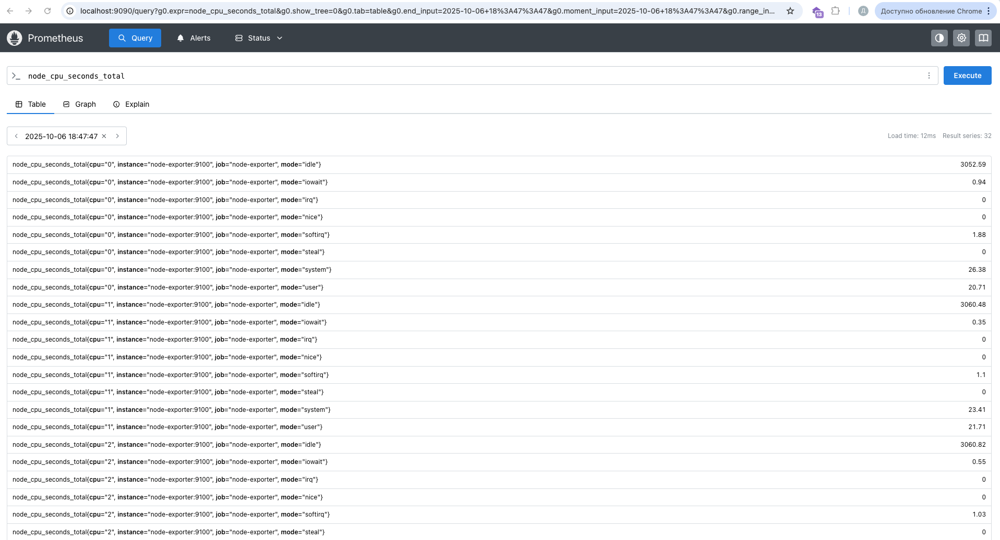
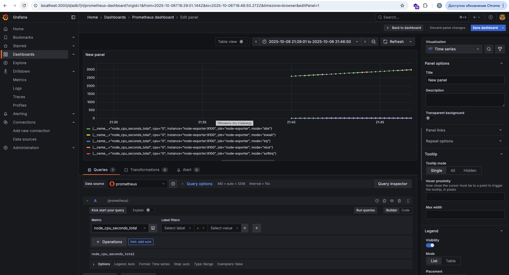
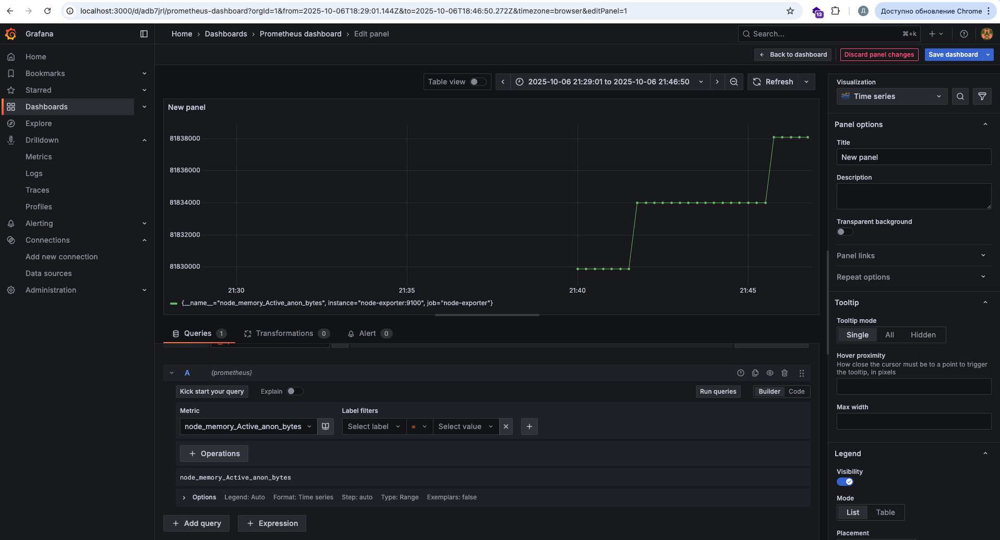
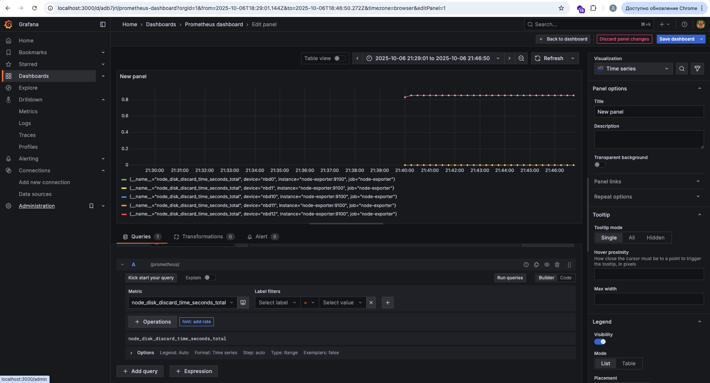

University: [ITMO University](https://itmo.ru/ru/)\

Faculty: [FTMI](https://ftmi.itmo.ru/)\

Course: [Введение в веб технологии](https://itmo-ict-faculty.github.io/introduction-in-web-tech/)\

Year: 2025/2026\

Group: U4225\

Author: Korinenko Daniil Trofimovich\

Lab: Lab3\

Date of create: 06.10.2025\

Date of finished: \

### Base task

1. Запустили `node-exporter` 
2. Запустили и проверили `prometheus` 
3. Запустили и проверили `grafana` 
4. Создали сеть Docker с помощью `docker network create monitoring` и добавили соединение с `Prometheus` 
5. В Prometheus метрики собираются 
6. В Grafana графики строятся 
7. График по памяти 
9. График по диску 
